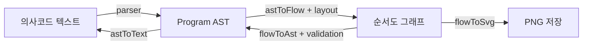

# 아키텍처

## 설계 목표

이 애플리케이션의 핵심은 의사코드와 순서도를 따로 관리하지 않고 하나의 알고리즘을 두 가지 방식으로 편집하는 것입니다. 이를 위해 양쪽 표현이 공통 중간 표현인 AST를 공유합니다.



이 구조의 중요한 결과는 다음과 같습니다.

- 의사코드 편집과 순서도 편집이 같은 `Program`을 갱신합니다.
- 한쪽을 수정하면 반대쪽 표현을 AST에서 다시 생성합니다.
- 문법과 그래프 구조가 잘못된 중간 상태는 AST에 반영하지 않고 사용자에게 해결 방법을 안내합니다.
- PNG 저장은 화면 캡처가 아니라 그래프 데이터로 다시 그리므로 UI 상태에 영향을 받지 않습니다.

## 데이터 모델

[`src/core/ast.ts`](../src/core/ast.ts)의 `Program`은 시작과 끝 사이에 있는 문장만 보관합니다.

```typescript
interface Program {
  body: Statement[]
}
```

`Statement`는 대입, 입력, 출력, 반복, 조건 분기로 구성됩니다. `시작`과 `끝`은 AST 노드가 아니라 `Program`에 암묵적으로 포함됩니다.

빈 `body`는 특별한 초기 상태입니다.

- `astToText({ body: [] })` → `시작`
- `astToFlow({ body: [] })` → 시작 기호 하나, 화살표 없음
- 시작 기호 하나뿐인 그래프를 `flowToAst`에 넣으면 `{ body: [] }`

본문이 생기면 의사코드와 순서도 모두 `끝`이 필요합니다.

## 상태와 동기화

전역 상태는 [`src/store/useAppStore.ts`](../src/store/useAppStore.ts)의 zustand store가 관리합니다.

| 상태 | 역할 |
| --- | --- |
| `program` | 현재 유효한 AST |
| `code` | 편집기에 보이는 의사코드 초안 |
| `parseError` | 현재 의사코드의 문법 오류 |
| `graphMessage` | 순서도를 AST로 바꿀 수 없을 때 보여 줄 안내 |
| `revision` | 외부에서 새 AST가 들어왔음을 캔버스에 알리는 번호 |
| `source` | 변경 출처: `text`, `flow`, `example` |

### 의사코드에서 수정할 때

1. `updateCodeDraft`가 입력값을 즉시 `code`에 보관합니다.
2. [`src/App.tsx`](../src/App.tsx)가 300ms 디바운스 후 `commitCode`를 호출합니다.
3. 파싱에 성공하면 `program`, `revision`, `source`가 갱신됩니다.
4. 실패하면 유효한 기존 `program`은 유지하고 `parseError`만 저장합니다.
5. `FlowCanvas`는 새 `revision`을 보고 AST에서 그래프를 다시 만듭니다.

### 순서도에서 수정할 때

1. 노드 또는 엣지 변경 전에 `beginFlowEdit`가 의사코드의 미확정 오류 상태를 정리합니다.
2. `FlowCanvas`가 변경된 그래프를 `flowToAst`로 검증합니다.
3. 성공하면 `setProgram(..., "flow")`이 AST와 의사코드를 갱신합니다.
4. 실패하면 그래프는 편집 가능한 상태로 남겨 두고 `graphMessage`에 다음 행동을 안내합니다.

`FlowCanvas`는 `source === "flow"`인 갱신을 다시 AST에서 그래프로 만들지 않습니다. 사용자가 옮긴 위치를 자동 배치로 덮거나 양방향 갱신이 순환하는 것을 막기 위한 규칙입니다. 의사코드와 예제에서 들어온 새 `revision`만 다시 배치합니다.

## 화면과 라우팅

화면은 두 개이며 [`src/hooks/useHashRoute.ts`](../src/hooks/useHashRoute.ts)가 URL 해시를 읽습니다.

| 주소 | 화면 |
| --- | --- |
| `#/` | 의사코드·순서도 편집 화면 |
| `#/examples` | 예제 선택 화면 |

예제 화면으로 이동해도 편집 화면은 DOM에서 제거하지 않고 `hidden`으로 감춥니다. 따라서 예제를 둘러보다가 돌아와도 편집 중인 그래프와 viewport가 유지됩니다. 브라우저 뒤로가기와 주소 공유는 해시 변경으로 동작합니다.

## 모듈 책임

| 경로 | 책임 |
| --- | --- |
| `src/core/` | UI와 무관한 AST, 파싱, 그래프 변환, 검증, 경로 계산, SVG 생성 |
| `src/components/` | CodeMirror, React Flow, 팔레트, 예제 화면 등 사용자 인터페이스 |
| `src/store/` | 유효한 AST와 두 편집 표현 사이의 동기화 |
| `src/hooks/` | 해시 기반 화면 전환 |
| `src/examples/` | 학습용 예제 AST |

`src/core/`는 가능한 한 DOM과 React에 의존하지 않는 순수 로직으로 유지합니다. 변환 규칙을 이 영역에 모으면 Vitest로 빠르게 검증하고 화면과 PNG에서 같은 결과를 재사용할 수 있습니다.

## 현재 범위에 포함하지 않은 기능

- 조건식 평가와 한 단계씩 실행하는 애니메이션
- `localStorage`를 이용한 작업 자동 저장
- 휴대폰과 태블릿 세로 모드용 별도 레이아웃
- 다크 모드

이 기능들을 추가할 때도 AST 중심 동기화와 문자열 보존 원칙을 먼저 검토해야 합니다. 특히 실행 기능은 현재의 자유로운 한국어 조건식을 평가 가능한 식 문법으로 확장해야 하므로 단순 UI 변경이 아닙니다.
