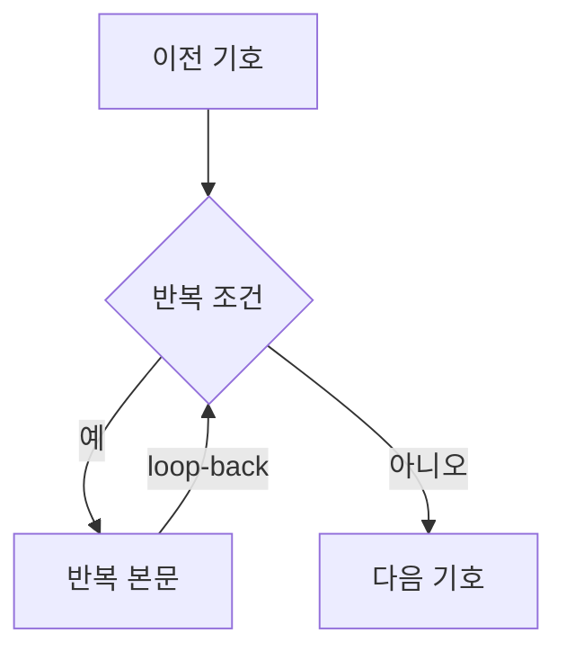
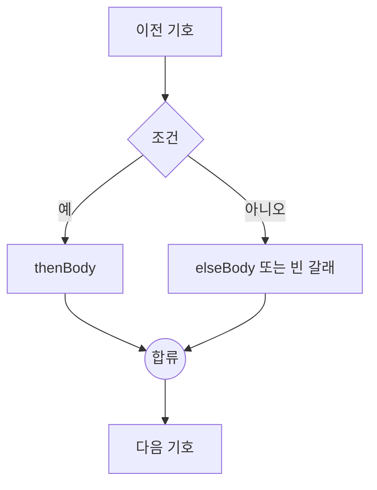

# 순서도 변환과 렌더링

기호의 의미, 색상, 크기, 텍스트와 화살표 표준은 [순서도 기호 규칙](./flowchart-symbols.md)을 기준으로 합니다. 이 문서는 그 기호들을 AST와 그래프 사이에서 변환하고 배치하는 방법을 설명합니다.

## 그래프 모델

순서도는 React Flow의 노드와 엣지를 확장한 타입을 사용합니다. 정의는 [`src/core/flowTypes.ts`](../src/core/flowTypes.ts)에 있습니다.

| `kind`     | 의미           | 화면 기호   | AST 대응              |
| ---------- | -------------- | ----------- | --------------------- |
| `terminal` | 시작·끝        | 둥근 사각형 | `Program` 경계        |
| `input`    | 입력           | 평행사변형  | `input`               |
| `output`   | 출력           | 평행사변형  | `output`              |
| `process`  | 일반 동작·대입 | 직사각형    | `action`, `assign`    |
| `decision` | 반복·조건      | 마름모      | `loop`, `if`          |
| `junction` | 조건 분기 합류 | 작은 원     | AST에는 노출되지 않음 |

판단 노드에는 `controlKind`가 있어 반복과 조건을 구분합니다. `예`가 나가는 쪽은 기호마다 다르지 않고 항상 왼쪽이므로(`nodeGeometry.ts`의 `YES_SIDE`) 노드 데이터에 저장하지 않습니다.

엣지에는 서로 다른 두 가지가 함께 적힙니다.

- `sourceHandle`: 기호의 **어느 자리에서 나가는지** — `yes`, `no`, `next`
- `data.branch`: **선의 종류** — `next`, `yes`, `no`, `loop-back`

대개 둘은 같지만 항상 그렇지는 않습니다. 반복 본문이 또 다른 반복으로 끝나면 안쪽 판단의 `아니오` 꼭짓점에서 바깥 판단으로 되돌아가는 선이 생깁니다. 이 선은 `sourceHandle: "no"`(라벨 `아니오`)이면서 `branch: "loop-back"`(복귀선)입니다. 둘을 하나로 합치면 안쪽 판단에서 `아니오` 화살표가 사라져 의사코드로 되돌릴 수 없게 됩니다.

## AST → 그래프

[`src/core/astToFlow.ts`](../src/core/astToFlow.ts)의 `astToFlow`는 AST를 구조화된 그래프로 만듭니다.

### 일반 문장

일반 동작, 대입, 입력, 출력 문장은 노드 하나로 바뀌고 앞 문장의 출구와 `next` 엣지로 연결됩니다. `action.text`는 처리 직사각형의 라벨로 그대로 표시됩니다.

### 반복



반복 본문의 마지막 출구는 판단 노드로 되돌아갑니다. `예` 본문이 왼쪽에 있으므로 되돌아가는 선도 전체 그래프 왼쪽의 전용 lane을 사용해 오른쪽 `아니오` 진행선과 겹치지 않게 합니다. 중첩 반복은 짧은 반복부터 lane을 배정하고 바깥쪽으로 26px씩 넓힙니다.

학생이 캔버스에서 직접 이을 때 **어느 화살표가 복귀선인지**는 `graphTopology.ts`의 `isLoopBackConnection`이 가립니다. 출발 기호가 그 판단에서 흘러나온 본문 안에 있으면(판단에서 화살표를 따라 닿으면) 복귀선입니다. 아직 본문이 판단과 이어지지 않아 안팎을 가릴 수 없을 때만, 바깥에서 들어온 화살표가 이미 있는지로 판단합니다. "들어오는 화살표가 이미 있으면 복귀선"으로만 보면 학생이 복귀선을 먼저 그렸을 때 들어오는 선과 복귀선이 통째로 뒤바뀝니다.

예외가 하나 있습니다. 복귀선이 판단의 `아니오` 꼭짓점에서 나가는 경우(본문이 또 다른 반복으로 끝날 때)에는 오른쪽에서 출발하므로 왼쪽 lane으로 끌고 가면 마름모 아래를 가로지릅니다. 그때는 오른쪽 lane을 씁니다. 이때 안쪽 판단과 같은 높이에 바깥 흐름의 기호(`끝` 등)가 놓이면 꼭짓점 높이 그대로 가는 수평 선이 그 기호 뒤를 지나므로, `loopBackRoute`는 통로로 가는 수평 선과 목적지로 들어오는 수평 선의 높이를 기호를 피해 고릅니다. 꼭짓점 옆으로 24px 나간 뒤 기호의 위나 아래로 비켜 통로에 닿습니다.

### 조건 분기



두 갈래는 내부 `junction` 노드에서 다시 만납니다. `elseBody`가 비어 있어도 `아니오` 엣지가 합류점으로 직접 연결됩니다. 합류점은 의사코드에는 나타나지 않는 그래프 전용 구조입니다.

## 판단 종류 바꾸기

편집 대화상자에서 판단 기호를 `조건 분기` ↔ `반복`으로 바꿀 수 있습니다. [`src/core/decisionKind.ts`](../src/core/decisionKind.ts)의 `changeDecisionKind`가 방향별로 합류점과 연결을 처리합니다.

| 바꾸는 방향      | 옮기는 화살표                                                                                                                                                                                                                                                                                  |
| ---------------- | ---------------------------------------------------------------------------------------------------------------------------------------------------------------------------------------------------------------------------------------------------------------------------------------------- |
| 조건 분기 → 반복 | 합류점과 그곳에 들어오거나 나가는 모든 선을 삭제합니다. 자동 재배선하지 않습니다.                                                                                                                                                                                                              |
| 반복 → 조건 분기 | 복귀선을 새 합류점으로 보내고, `아니오`도 합류점을 지나게 한 뒤 합류점에서 원래의 다음 기호로 잇습니다. 복귀선이 하나도 없는 닫히지 않은 반복(조건→반복 직후가 그렇습니다)은 `아니오`가 아니면 본문으로 가고 있을 수 있으므로 어느 화살표도 옮기지 않고 짝 합류점만 두 갈래 아래에 준비합니다. |

`예`와 `아니면` 본문 기호, 합류점에 닿지 않는 선은 그대로 보존합니다. 삭제 후에는 사용자가 반복 흐름을 다시 연결해야 하며, 그동안 미완성 그래프 안내가 표시될 수 있습니다.

반복으로 바꿀 때 짝 ID(`<판단 id>-junction`)의 합류점이 있으면 연결 상태와 무관하게 제거합니다. 짝 ID가 없으면 두 갈래의 연결 관계로 합류점을 찾습니다.

팔레트에서 놓은 판단 기호에는 아직 잇지 않은 짝 합류 기호(`<판단 id>-junction`)가 딸려 있습니다. 반복으로 바꾸면 이 기호는 쓸 데가 없으므로 지우고, 조건 분기로 바꾸면 새로 만드는 대신 이 기호를 제자리에서 잇습니다. 이미 이어진 합류점이 있으면 조건 분기 모양이 갖춰진 것이므로 손대지 않습니다.

아직 만드는 중이라 옮길 연결이 없어도 조건 분기로 바꾸면 짝 합류점을 생성합니다. 이미 연결되지 않은 짝이 있으면 그대로 재사용하고, 없는 화살표는 임의로 만들지 않습니다. 따라서 연결 전 조건→반복→조건 전환에서도 합류점을 다시 사용할 수 있습니다. 옮긴 화살표의 `routePoints`는 지웁니다. 자동 배치가 계산해 둔 경로는 갈래가 바뀐 뒤에는 더 이상 맞지 않기 때문입니다. 다만 복귀선은 경로가 없으면 왼쪽으로 크게 도는 곡선으로 그려져 사이의 기호를 가로지를 수 있으므로, 자동 배치와 같은 모양으로 순서도 바깥 통로를 도는 직각 경로를 새로 계산해 둡니다(아래쪽에서 나가면 왼쪽 통로, `아니오` 꼭짓점에서 나가면 오른쪽 통로).

바깥 반복 본문의 마지막 조건을 반복으로 바꾸면 합류점에서 바깥 판단으로 돌아가던 선도 삭제합니다. 반대로 안쪽 반복을 조건으로 바꾸면 기존 `아니오` 복귀선을 새 합류점의 복귀선으로 옮깁니다.

## 판단 기호 지우기

합류 기호는 조건 분기의 두 갈래가 다시 만나는 자리라 판단 기호 없이는 뜻이 없습니다. 판단만 지우면 합류 기호가 홀로 남아 "연결이 끊겨 있어요"가 뜨고 학생이 따로 지워야 합니다. 그래서 [`src/core/removeNodes.ts`](../src/core/removeNodes.ts)의 `removeNodes`가 판단 기호를 지울 때 짝 합류 기호를 함께 지웁니다. 툴바의 `삭제`, 키보드 삭제, React Flow의 삭제 변경이 모두 이 함수를 지납니다.

- 연결되지 않은 짝 합류 기호는 `<판단 id>-junction` 규칙으로 찾아 지웁니다.
- 연결된 조건 분기는 `graphTopology.ts`에서 두 갈래가 처음 만나는 기호가 합류점인지 확인합니다. 다음 판단에서 먼저 만난다면 그 뒤의 합류점까지 지우지 않습니다. 다른 판단의 짝이나 외부 입력을 받는 공유 합류점, 소유 관계가 불명확한 합류점은 보존합니다. 반복 판단은 연결되지 않은 짝만 지웁니다.
- 노드와 화살표를 함께 선택해도 원본 연결에서 삭제 대상을 먼저 결정한 뒤 한 번에 제거합니다.
- 지워진 기호에 닿아 있던 화살표도 모두 지웁니다. 갈래 본문 기호는 남으므로 학생이 다시 이을 수 있습니다.

## 화면에서 만든 순서도 자동 배치

캔버스 조작 막대의 `자동 배치하고 화면 맞추기` 버튼은 [`src/core/autoLayout.ts`](../src/core/autoLayout.ts)의 `autoLayoutGraph`로 지금 화면에 있는 그래프를 다시 배치합니다. 아래 자동 배치 규칙을 그대로 씁니다.

**의사코드로 되돌렸다가 다시 그리지 않습니다.** 그러면 기호 id가 바뀌고, 아직 잇지 않은 기호는 AST에 담기지 않아 사라집니다. 순서도가 엉켜 정리하고 싶을 때는 대개 만드는 도중이므로, 있는 기호를 그대로 두고 자리만 옮깁니다. 연결이 끊긴 기호도 dagre가 따로 떨어진 덩어리로 배치합니다.

`astToFlow`는 그래프를 만들면서 어느 기호가 어느 갈래인지(`BranchGroup`) 적어 두지만 학생이 직접 이은 그래프에는 그 기록이 없습니다. `deriveBranchGroups`가 화살표를 따라가 되짚습니다.

| 판단 종류 | `예` 갈래                                | `아니오` 갈래                    |
| --------- | ---------------------------------------- | -------------------------------- |
| 반복      | 판단으로 돌아오기 전까지 닿는 기호(본문) | 비움 — 반복을 빠져나간 뒤의 흐름 |
| 조건      | `예`에서만 닿는 기호                     | `아니오`에서만 닿는 기호         |

양쪽에서 모두 닿는 기호를 빼는 것이 핵심입니다. 그러지 않으면 `아니면`이 빈 조건에서 합류점 아래의 나머지 순서도까지 한 갈래로 잡혀 통째로 뒤집힙니다. 이 규칙이 맞는지는 **자동 배치한 그래프를 다시 자동 배치해도 좌표가 같은지**로 검증합니다([`autoLayout.test.ts`](../src/core/autoLayout.test.ts)).

되돌릴 수 있어야 하므로 `FlowCanvas`는 `commitGraph`로 반영합니다. 버튼 배치와 화면 맞추기 순서는 [UI와 터치 입력](./ui-touch.md#화면-맞추기)에 있습니다.

## 자동 배치와 화살표 경로

`layoutFlowGraph`는 dagre를 위→아래 방향으로 실행합니다.

```text
rankdir = TB
nodesep = 54
ranksep = 86
marginx = 36
marginy = 28
```

`ranksep`은 `nodeGeometry.ts`의 `RANK_GAP`입니다. 판단 기호의 짝 합류점을 손으로 놓을 때도 같은 값을 써서, 팔레트에서 막 놓은 기호가 자동 배치한 순서도와 같은 간격이 되게 합니다.

배치에 넣는 크기는 **화면에서 잰 크기(`measured`)가 있으면 그것**입니다(`sizeOf`). 기호 안에 긴 글을 넣으면 도형이 `min-height`보다 커지는데, 표준 크기(`NODE_SIZES`)로 자리를 잡으면 늘어난 만큼 아래 기호를 덮습니다. 의사코드에서 갓 만든 그래프에는 `measured`가 없으므로 표준 크기가 그대로 쓰입니다.

반복 복귀선은 dagre의 순위 계산에서 제외한 뒤 별도 경로를 만듭니다. 일반 화살표도 dagre가 만든 좌표를 바탕으로 `routePoints`를 계산해 도형 사이에서 직각으로 꺾습니다.

### 판단 기호의 좌우 방향

`예`는 마름모의 왼쪽 꼭짓점, `아니오`는 오른쪽 꼭짓점에서 출발합니다. 연결점만 고정하면 본문이 반대편에 놓였을 때 `예` 화살표가 왼쪽으로 나갔다가 오른쪽 본문까지 되돌아와 `아니오`와 교차하므로, 본문 위치도 함께 맞춰야 합니다. 두 단계로 맞춥니다.

1. `decisionOrderConstraints`가 Dagre에 `예`의 첫 기호를 왼쪽에 두라고 알려 줍니다. **다만 항상 지켜지지는 않습니다.** 두 갈래가 같은 순위의 이웃으로 놓이는 모양(반복 등)에서는 그대로 따르지만, 본문 길이가 다른 조건·`아니면`이 빈 조건·중첩된 조건에서는 조용히 무시됩니다.
2. 그래서 배치가 끝난 뒤 `normalizeBranchSides`가 실제 좌표를 보고 뒤집힌 판단만 바로잡습니다. 뒤집혔는지는 **갈래의 첫 기호**(화살표가 실제로 닿는 기호)로 판단합니다. 갈래 전체의 평균 위치를 보면 안쪽 반복 본문처럼 옆으로 밀려난 기호가 평균을 끌어당겨, 첫 기호는 제자리인데 뒤집거나 첫 기호가 반대편인데 지나칩니다.
   - `예` 첫 기호가 `아니오` 첫 기호보다 오른쪽이면 두 갈래가 자리를 바꾼 것입니다. 두 갈래에 본문이 모두 있으면 두 첫 기호의 가운데를 축으로 서로 자리를 바꾸고, 한쪽이 비어 있으면 흐름이 지나가는 열(합류점이나 반복 뒤의 기호)을 축으로 본문만 반대편으로 넘깁니다.
   - 순서는 맞아도 두 갈래가 마름모의 한쪽에 몰려 있을 수 있습니다. `예` 첫 기호가 마름모 가운데보다 오른쪽이면 그 본문만 마름모를 축으로 왼쪽으로 넘깁니다. `아니오`도 마찬가지입니다.
   - 바깥 판단부터 처리해 안쪽이 함께 뒤집힌 경우까지 다시 맞춥니다.

   본문을 축 기준으로 넘기는 방식이라 넘긴 본문이 이웃 갈래의 기호와 겹칠 수 있습니다. 깊게 중첩된 프로그램에서 드물게 나타나며, 학생이 기호를 끌어 옮길 수 있으므로 그대로 둡니다.

어느 기호가 어느 갈래인지는 완성된 그래프를 되짚어 추측하지 않고, `astToFlow`가 그래프를 만들면서 `BranchGroup`에 적어 둡니다.

좌우 보정 뒤에는 노드 경계의 겹침을 검사합니다. 겹치는 노드와 후속 행을 아래로 밀어 54px 간격을 확보하고, 최종 좌표로 화살표 경로를 다시 계산합니다. 중첩이 복잡한 순서도는 그만큼 세로로 길어질 수 있습니다.

노드 크기와 연결점 좌표는 `nodeGeometry.ts`, 복귀선 경로와 화살표 표시는 `flowEdges.ts`에서 공유합니다. 자동 배치·판단 종류 변경·수동 연결이 같은 복귀선 규칙을 사용합니다.

화살표 경로(`routePoints`)는 좌표에 맞춰 계산해 둔 값이라 학생이 기호를 끌어 옮기거나 긴 글을 넣어 기호가 커지면 낡아서, 옮긴 기호 뒤로 선이 지나가거나 긴 사선이 그려집니다. 그래서 `routeEdges`가 자동 배치 직후뿐 아니라 그래프가 바뀔 때마다(`FlowCanvas`의 `replaceGraph`, 즉 끌기·편집·연결·되돌리기 전부, 그리고 저장해 둔 그래프를 되살릴 때) 모든 화살표를 지금 위치와 화면에서 측정한 크기로 다시 계산합니다. 일반 화살표의 직각 경로(아래쪽 출발은 중간 높이에서 한 번 꺾기, 다음 기호가 위나 옆에 있으면 두 기호 오른쪽 바깥 열로 돌아가기, 예/아니오는 꼭짓점에서 옆으로 간 뒤 내려가기, 빈 갈래는 바깥 통로)와 복귀선의 통로 배정(짧은 반복이 안쪽, 바깥으로 26px씩)이 모두 이 함수에 있습니다. 일반 화살표도 복귀선과 같은 규칙으로 다른 기호를 피합니다. 내려가는 세로 선은 길목에 기호가 있으면 옆 열로, 가로 선은 위아래로 비킵니다. 경로가 그대로인 화살표는 같은 객체를 돌려주어 불필요한 다시 그리기를 피합니다.

다음 세 곳은 반드시 같은 왼쪽 `예` 규칙을 사용해야 합니다.

- [`src/core/astToFlow.ts`](../src/core/astToFlow.ts)의 경로 계산
- [`src/components/nodes/FlowNodes.tsx`](../src/components/nodes/FlowNodes.tsx)의 연결점 위치
- [`src/core/flowToSvg.ts`](../src/core/flowToSvg.ts)의 이미지 출력

값이 어긋나면 화살표가 마름모를 가로지르거나 화면과 PNG의 방향이 달라집니다.

## 그래프 → AST 검증

[`src/core/flowToAst.ts`](../src/core/flowToAst.ts)는 자유롭게 편집된 그래프가 구조화된 AST로 바뀔 수 있는지 검사합니다. 올바른 그래프는 다음 조건을 만족해야 합니다.

- 시작 기호는 정확히 하나이고 들어오는 화살표가 없어야 합니다.
- 본문이 있으면 끝 기호가 정확히 하나이고 들어오는 화살표도 하나여야 합니다.
- 끝 기호에서는 화살표가 나갈 수 없습니다.
- 시작에서 모든 기호에 도달할 수 있어야 합니다.
- 일반 문장에서는 다음 화살표가 정확히 하나 나가야 합니다.
- 판단 기호에는 `예`, `아니오` 화살표가 하나씩 있어야 합니다.
- 반복의 `예` 경로에는 문장이 하나 이상 있고 같은 판단 기호로 돌아와야 합니다.
- 조건의 `예` 경로에는 문장이 하나 이상 있어야 하며 두 갈래가 같은 합류점에서 만나야 합니다.
- 합류점에는 두 화살표가 들어오고 다음 화살표가 하나 나가야 합니다.
- 시작 기호 하나만 있고 엣지가 없는 그래프만 끝 기호 없는 빈 프로그램으로 허용합니다.

검증 실패는 `FlowValidationError`로 전달합니다. 오류 메시지는 그래프를 버리거나 자동 수정하지 않고 사용자가 이어서 완성할 수 있도록 다음 행동을 설명해야 합니다.

## 도형 렌더링

평행사변형과 마름모는 CSS `clip-path` 대신 인라인 SVG `polygon`으로 그립니다. `clip-path`는 테두리 상자까지 잘라 비스듬한 변의 윤곽선이 사라지기 때문입니다.

팔레트, 캔버스, 저장 이미지는 꼭짓점을 [`shapeGeometry.ts`](../src/core/shapeGeometry.ts)의 `SHAPE_OUTLINE_POINTS`(0~1로 정규화) 한 곳에서 끌어와 각자의 좌표계로 늘립니다. 세 곳에 따로 적어 두면 한 곳만 기울기가 달라져도 알아채기 어렵습니다.

판단에는 마름모를 사용합니다. 육각형은 순서도에서 준비 기호이므로 판단 기호로 바꾸지 않습니다.

## 연결점과 터치 영역

연결점의 실제 React Flow `Handle` 상자는 16×16px입니다. 44×44px 터치 영역은 CSS `::before`의 `inset: -14px`로 확장합니다.

`Handle` 자체를 44px로 키우면 React Flow가 상자의 바깥 모서리에 화살표 끝을 붙입니다. 위아래 연결점이 각각 44px씩 간격 안으로 들어오면서 86px인 노드 간격의 화살표가 약 2px로 줄어들 수 있으므로 이 구조를 유지해야 합니다.

## PNG 저장

[`src/core/flowToSvg.ts`](../src/core/flowToSvg.ts)는 그래프 좌표로 독립 SVG를 만든 뒤 [`FlowCanvas`](../src/components/FlowCanvas.tsx)가 canvas에 2배 크기로 그려 PNG를 내려받습니다.

화면 캡처 방식을 사용하지 않는 이유는 React Flow의 여러 SVG와 `overflow: visible` 경로가 캡처 과정에서 잘리고 분기 라벨이 깨질 수 있기 때문입니다.

저장 과정의 규칙은 다음과 같습니다.

- 노드뿐 아니라 `routePoints`까지 포함해 이미지 범위를 계산합니다.
- 도형, 화살표, 라벨을 SVG에서 직접 그립니다.
- 텍스트는 `foreignObject`를 사용해 화면과 비슷하게 줄바꿈합니다.
- 배경은 흰색이며 손잡이, 선택 테두리, 편집 툴바는 제외합니다.
- 화면과 PNG는 [`src/core/edgeGeometry.ts`](../src/core/edgeGeometry.ts)의 경로 함수를 공유합니다.

`graphBounds`는 PNG 범위뿐 아니라 캔버스 화면 맞추기에도 사용합니다. 노드가 적을 때 원래 크기보다 확대하지 않도록 자동 맞춤의 최대 배율은 1입니다.

## 함께 변경해야 하는 값

| 변경 항목           | 함께 확인할 곳                                                                            |
| ------------------- | ----------------------------------------------------------------------------------------- |
| 노드 크기           | `nodeGeometry.ts`의 `NODE_SIZES`, `styles/index.scss`의 도형 치수, SVG 출력과 경로 테스트 |
| 기호 윤곽선 모양    | `shapeGeometry.ts`의 `SHAPE_OUTLINE_POINTS` 한 곳 — 팔레트·캔버스·SVG가 여기서 파생       |
| 기호 색상           | `styles/_tokens.scss`, `constants/flowColors.ts`                                          |
| 일반·반복 화살표 색 | `styles/_tokens.scss`, `constants/flowColors.ts`                                          |
| 화살표 굵기·화살촉  | CSS `--edge-width`, `ARROW_MARKER_SIZE`, SVG marker 크기                                  |
| 기호 사이 간격      | `nodeGeometry.ts`의 `RANK_GAP` — dagre `ranksep`과 합류점 배치가 함께 씀                  |
| 판단 좌우 연결      | `YES_SIDE`, `normalizeBranchSides`, 노드 Handle, 경로 생성, SVG source point              |
| 판단 종류 전환      | `decisionKind.ts`의 재배선 규칙, `flowToAst.ts`의 반복·조건 검증                          |
| 합류 기호 생성·삭제 | `graphTopology.ts`의 `createJunctionNode`·`junctionIdOf`, `removeNodes.ts`의 짝 찾기      |
