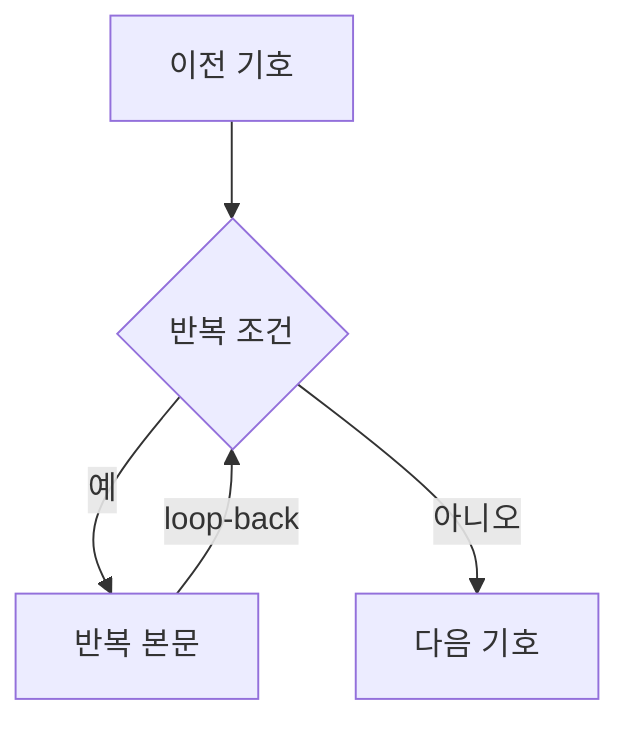
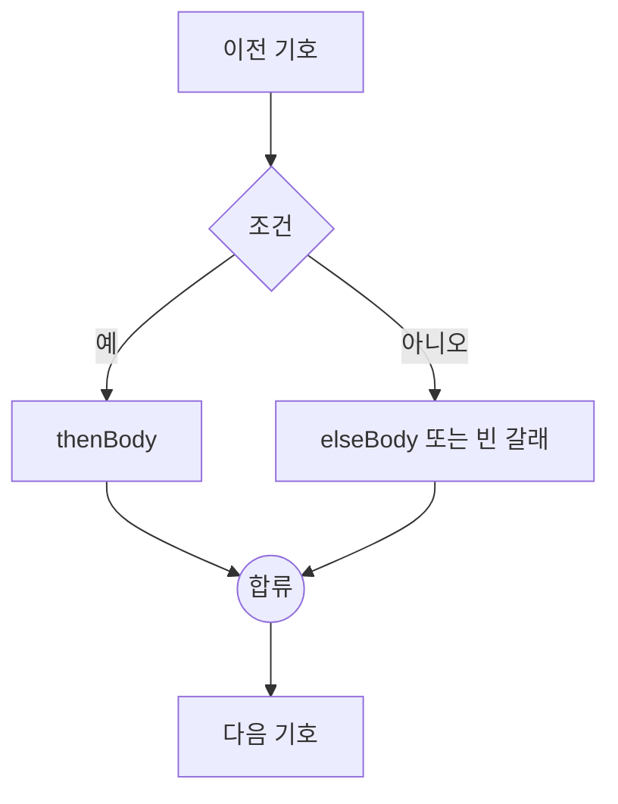

# 순서도 변환과 렌더링

기호의 의미, 색상, 크기, 텍스트와 화살표 표준은 [순서도 기호 규칙](./flowchart-symbols.md)을 기준으로 합니다. 이 문서는 그 기호들을 AST와 그래프 사이에서 변환하고 배치하는 방법을 설명합니다.

## 그래프 모델

순서도는 React Flow의 노드와 엣지를 확장한 타입을 사용합니다. 정의는 [`src/core/flowTypes.ts`](../src/core/flowTypes.ts)에 있습니다.

| `kind`     | 의미           | 화면 기호   | AST 대응              |
| ---------- | -------------- | ----------- | --------------------- |
| `terminal` | 시작·끝        | 둥근 사각형 | `Program` 경계        |
| `input`    | 입력           | 평행사변형  | `input`               |
| `output`   | 출력           | 평행사변형  | `output`              |
| `process`  | 대입·계산      | 직사각형    | `assign`              |
| `decision` | 반복·조건      | 마름모      | `loop`, `if`          |
| `junction` | 조건 분기 합류 | 작은 원     | AST에는 노출되지 않음 |

판단 노드에는 `controlKind`가 있어 반복과 조건을 구분하고, `yesSide`가 `예` 화살표의 좌우 방향을 기록합니다. 엣지의 `branch`는 `next`, `yes`, `no`, `loop-back` 중 하나입니다.

## AST → 그래프

[`src/core/astToFlow.ts`](../src/core/astToFlow.ts)의 `astToFlow`는 AST를 구조화된 그래프로 만듭니다.

### 일반 문장

대입, 입력, 출력 문장은 노드 하나로 바뀌고 앞 문장의 출구와 `next` 엣지로 연결됩니다.

### 반복



반복 본문의 마지막 출구는 판단 노드로 되돌아갑니다. 되돌아가는 선은 일반 흐름과 겹치지 않도록 전체 그래프 오른쪽의 전용 lane을 사용합니다. 중첩 반복은 짧은 반복부터 lane을 배정하고 바깥쪽으로 26px씩 넓힙니다.

### 조건 분기



두 갈래는 내부 `junction` 노드에서 다시 만납니다. `elseBody`가 비어 있어도 `아니오` 엣지가 합류점으로 직접 연결됩니다. 합류점은 의사코드에는 나타나지 않는 그래프 전용 구조입니다.

## 자동 배치와 화살표 경로

`layoutFlowGraph`는 dagre를 위→아래 방향으로 실행합니다.

```text
rankdir = TB
nodesep = 54
ranksep = 86
marginx = 36
marginy = 28
```

반복 복귀선은 dagre의 순위 계산에서 제외한 뒤 별도 경로를 만듭니다. 일반 화살표도 dagre가 만든 좌표를 바탕으로 `routePoints`를 계산해 도형 사이에서 직각으로 꺾습니다.

### 판단 기호의 좌우 방향

`예`와 `아니오`는 마름모 아래쪽 한 점이 아니라 서로 반대쪽 꼭짓점에서 출발합니다. 배치가 끝난 뒤 `decisionSides`가 두 목적지의 중심을 비교하여 다음 기호가 있는 쪽을 `예` 방향으로 선택합니다.

다음 세 곳은 반드시 같은 `yesSide`를 사용해야 합니다.

- [`src/core/astToFlow.ts`](../src/core/astToFlow.ts)의 경로 계산
- [`src/components/nodes/FlowNodes.tsx`](../src/components/nodes/FlowNodes.tsx)의 연결점 위치
- [`src/core/flowToSvg.ts`](../src/core/flowToSvg.ts)의 이미지 출력

값이 어긋나면 화살표가 마름모를 가로지르거나 화면과 PNG의 방향이 달라집니다.

## 그래프 → AST 검증

[`src/core/flowToAst.ts`](../src/core/flowToAst.ts)는 자유롭게 편집된 그래프가 구조화된 AST로 바뀔 수 있는지 검사합니다. 올바른 그래프는 다음 조건을 만족해야 합니다.

- 시작 기호는 정확히 하나이고 들어오는 화살표가 없어야 합니다.
- 본문이 있으면 끝 기호가 정확히 하나이고 들어오는 화살표도 하나여야 합니다.
- 끝 기호에서는 화살표가 나갈 수 없습니다.
- 시작에서 모든 기호에 도달할 수 있어야 합니다.
- 일반 문장에서는 다음 화살표가 정확히 하나 나가야 합니다.
- 판단 기호에는 `예`, `아니오` 화살표가 하나씩 있어야 합니다.
- 반복의 `예` 경로에는 문장이 하나 이상 있고 같은 판단 기호로 돌아와야 합니다.
- 조건의 `예` 경로에는 문장이 하나 이상 있어야 하며 두 갈래가 같은 합류점에서 만나야 합니다.
- 합류점에는 두 화살표가 들어오고 다음 화살표가 하나 나가야 합니다.
- 시작 기호 하나만 있고 엣지가 없는 그래프만 끝 기호 없는 빈 프로그램으로 허용합니다.

검증 실패는 `FlowValidationError`로 전달합니다. 오류 메시지는 그래프를 버리거나 자동 수정하지 않고 사용자가 이어서 완성할 수 있도록 다음 행동을 설명해야 합니다.

## 도형 렌더링

평행사변형과 마름모는 CSS `clip-path` 대신 인라인 SVG `polygon`으로 그립니다. `clip-path`는 테두리 상자까지 잘라 비스듬한 변의 윤곽선이 사라지기 때문입니다. 팔레트, 캔버스, 저장 이미지가 같은 좌표 비율을 사용해야 합니다.

판단에는 마름모를 사용합니다. 육각형은 순서도에서 준비 기호이므로 판단 기호로 바꾸지 않습니다.

## 연결점과 터치 영역

연결점의 실제 React Flow `Handle` 상자는 16×16px입니다. 44×44px 터치 영역은 CSS `::before`의 `inset: -14px`로 확장합니다.

`Handle` 자체를 44px로 키우면 React Flow가 상자의 바깥 모서리에 화살표 끝을 붙입니다. 위아래 연결점이 각각 44px씩 간격 안으로 들어오면서 86px인 노드 간격의 화살표가 약 2px로 줄어들 수 있으므로 이 구조를 유지해야 합니다.

## PNG 저장

[`src/core/flowToSvg.ts`](../src/core/flowToSvg.ts)는 그래프 좌표로 독립 SVG를 만든 뒤 [`FlowCanvas`](../src/components/FlowCanvas.tsx)가 canvas에 2배 크기로 그려 PNG를 내려받습니다.

화면 캡처 방식을 사용하지 않는 이유는 React Flow의 여러 SVG와 `overflow: visible` 경로가 캡처 과정에서 잘리고 분기 라벨이 깨질 수 있기 때문입니다.

저장 과정의 규칙은 다음과 같습니다.

- 노드뿐 아니라 `routePoints`까지 포함해 이미지 범위를 계산합니다.
- 도형, 화살표, 라벨을 SVG에서 직접 그립니다.
- 텍스트는 `foreignObject`를 사용해 화면과 비슷하게 줄바꿈합니다.
- 배경은 흰색이며 손잡이, 선택 테두리, 편집 툴바는 제외합니다.
- 화면과 PNG는 [`src/core/edgeGeometry.ts`](../src/core/edgeGeometry.ts)의 경로 함수를 공유합니다.

`graphBounds`는 PNG 범위뿐 아니라 캔버스 화면 맞추기에도 사용합니다. 노드가 적을 때 원래 크기보다 확대하지 않도록 자동 맞춤의 최대 배율은 1입니다.

## 함께 변경해야 하는 값

| 변경 항목           | 함께 확인할 곳                                                                         |
| ------------------- | -------------------------------------------------------------------------------------- |
| 노드 크기           | `astToFlow.ts`의 `NODE_SIZES`, `styles/index.scss`의 도형 치수, SVG 출력과 경로 테스트 |
| 기호 색상·윤곽선    | `styles/_tokens.scss`, `FlowNodes.tsx`, `Palette.tsx`, `flowToSvg.ts`                  |
| 일반·반복 화살표 색 | `styles/_tokens.scss`, `astToFlow.ts`, `flowToSvg.ts`                                  |
| 화살표 굵기·화살촉  | CSS `--edge-width`, `ARROW_MARKER_SIZE`, SVG marker 크기                               |
| 판단 좌우 연결      | `yesSide`, 노드 Handle, 경로 생성, SVG source point                                    |
