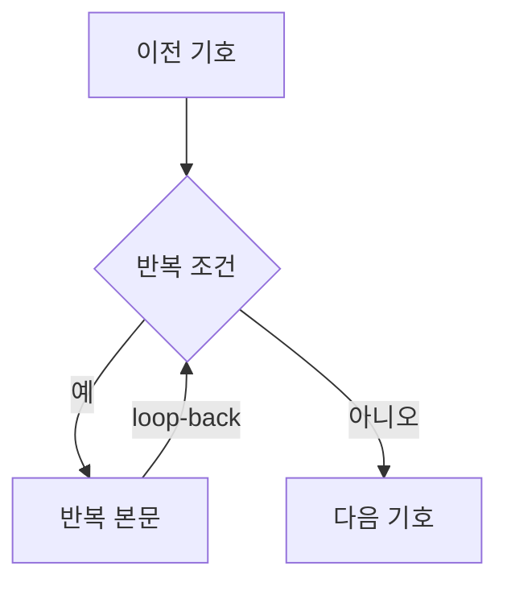
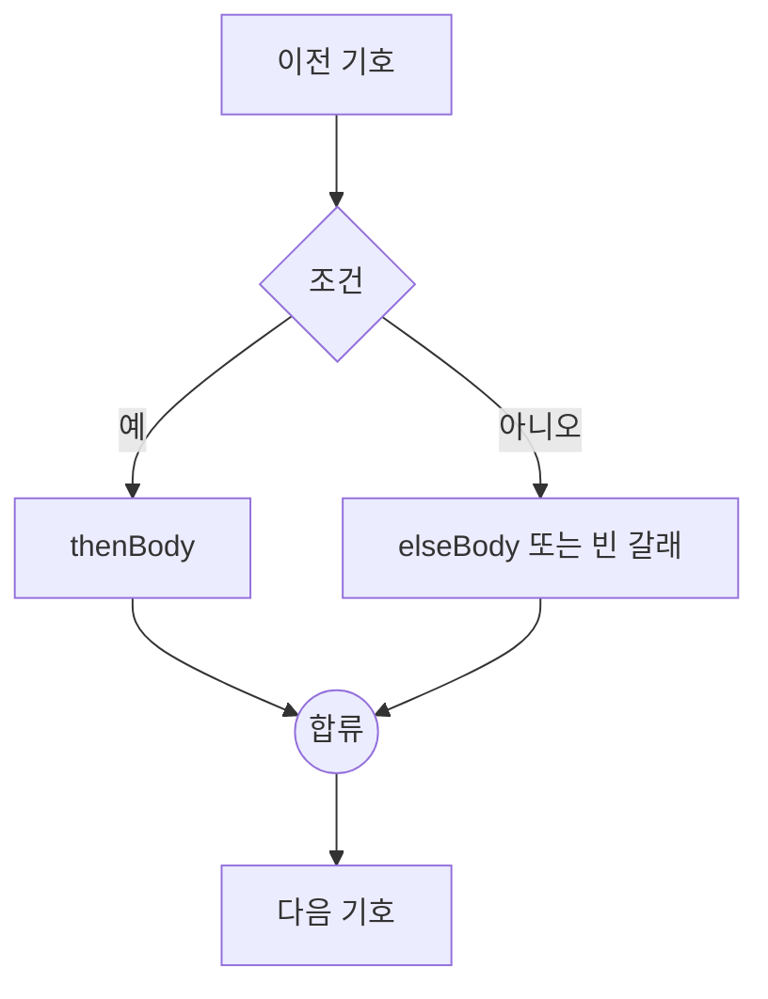

# 순서도 변환과 렌더링

기호의 의미, 색상, 크기, 텍스트와 화살표 표준은 [순서도 기호 규칙](./flowchart-symbols.md)을 기준으로 합니다. 이 문서는 그 기호들을 AST와 그래프 사이에서 변환하고 배치하는 방법을 설명합니다.

## 그래프 모델

순서도는 React Flow의 노드와 엣지를 확장한 타입을 사용합니다. 정의는 [`src/core/flowTypes.ts`](../src/core/flowTypes.ts)에 있습니다.

| `kind`     | 의미           | 화면 기호   | AST 대응              |
| ---------- | -------------- | ----------- | --------------------- |
| `terminal` | 시작·끝        | 둥근 사각형 | `Program` 경계        |
| `input`    | 입력           | 평행사변형  | `input`               |
| `output`   | 출력           | 평행사변형  | `output`              |
| `process`  | 일반 동작·대입 | 직사각형    | `action`, `assign`    |
| `decision` | 반복·조건      | 마름모      | `loop`, `if`          |
| `junction` | 조건 분기 합류 | 작은 원     | AST에는 노출되지 않음 |

판단 노드에는 `controlKind`가 있어 반복과 조건을 구분합니다. `예`가 나가는 쪽은 기호마다 다르지 않고 항상 왼쪽이므로(`nodeGeometry.ts`의 `YES_SIDE`) 노드 데이터에 저장하지 않습니다.

엣지에는 서로 다른 두 가지가 함께 적힙니다.

- `sourceHandle`: 기호의 **어느 자리에서 나가는지** — `yes`, `no`, `next`
- `data.branch`: **선의 종류** — `next`, `yes`, `no`, `loop-back`

대개 둘은 같지만 항상 그렇지는 않습니다. 반복 본문이 또 다른 반복으로 끝나면 안쪽 판단의 `아니오` 꼭짓점에서 바깥 판단으로 되돌아가는 선이 생깁니다. 이 선은 `sourceHandle: "no"`(라벨 `아니오`)이면서 `branch: "loop-back"`(복귀선)입니다. 둘을 하나로 합치면 안쪽 판단에서 `아니오` 화살표가 사라져 의사코드로 되돌릴 수 없게 됩니다.

## AST → 그래프

[`src/core/astToFlow.ts`](../src/core/astToFlow.ts)의 `astToFlow`는 AST를 구조화된 그래프로 만듭니다.

### 일반 문장

일반 동작, 대입, 입력, 출력 문장은 노드 하나로 바뀌고 앞 문장의 출구와 `next` 엣지로 연결됩니다. `action.text`는 처리 직사각형의 라벨로 그대로 표시됩니다.

### 반복



반복 본문의 마지막 출구는 판단 노드로 되돌아갑니다. `예` 본문이 왼쪽에 있으므로 되돌아가는 선도 전체 그래프 왼쪽의 전용 lane을 사용해 오른쪽 `아니오` 진행선과 겹치지 않게 합니다. 중첩 반복은 짧은 반복부터 lane을 배정하고 바깥쪽으로 26px씩 넓힙니다.

예외가 하나 있습니다. 복귀선이 판단의 `아니오` 꼭짓점에서 나가는 경우(본문이 또 다른 반복으로 끝날 때)에는 오른쪽에서 출발하므로 왼쪽 lane으로 끌고 가면 마름모 아래를 가로지릅니다. 그때는 오른쪽 lane을 씁니다. 이때 안쪽 판단과 같은 높이에 바깥 흐름의 기호(`끝` 등)가 놓이면 꼭짓점 높이 그대로 가는 수평 선이 그 기호 뒤를 지나므로, `loopBackRoute`는 통로로 가는 수평 선과 목적지로 들어오는 수평 선의 높이를 기호를 피해 고릅니다. 꼭짓점 옆으로 24px 나간 뒤 기호의 위나 아래로 비켜 통로에 닿습니다.

### 조건 분기



두 갈래는 내부 `junction` 노드에서 다시 만납니다. `elseBody`가 비어 있어도 `아니오` 엣지가 합류점으로 직접 연결됩니다. 합류점은 의사코드에는 나타나지 않는 그래프 전용 구조입니다.

## 판단 종류 바꾸기

편집 대화상자에서 판단 기호를 `조건 분기` ↔ `반복`으로 바꿀 수 있습니다. 두 종류는 흐름의 짜임이 통째로 달라서, 기호 종류만 바꾸고 화살표를 그대로 두면 순서도가 끊깁니다. [`src/core/decisionKind.ts`](../src/core/decisionKind.ts)의 `changeDecisionKind`가 **기호는 하나도 지우지 않고 화살표만 옮겨** 바꾼 즉시 다시 이어진 순서도가 되게 합니다.

| 바꾸는 방향      | 옮기는 화살표                                                                                                   |
| ---------------- | --------------------------------------------------------------------------------------------------------------- |
| 조건 분기 → 반복 | `예` 본문의 끝을 판단으로 되돌리고(복귀선), 합류점 뒤에 있던 흐름을 `아니오`가 이어받습니다. 합류점은 지웁니다. |
| 반복 → 조건 분기 | 복귀선을 새 합류점으로 보내고, `아니오`도 합류점을 지나게 한 뒤 합류점에서 원래의 다음 기호로 잇습니다.         |

`아니면` 본문이 있던 조건을 반복으로 바꾸면 그 기호들은 반복을 빠져나온 뒤의 흐름 안에 그대로 남습니다. 학생이 그린 것을 임의로 버리지 않기 위해서입니다.

합류점은 ID 이름이 아니라 복귀선을 제외한 두 갈래의 연결 관계로 찾습니다. 저장하거나 편집하면서 ID가 바뀌어도 같은 구조로 변환합니다.

팔레트에서 놓은 판단 기호에는 아직 잇지 않은 짝 합류 기호(`<판단 id>-junction`)가 딸려 있습니다. 반복으로 바꾸면 이 기호는 쓸 데가 없으므로 지우고, 조건 분기로 바꾸면 새로 만드는 대신 이 기호를 제자리에서 잇습니다. 이미 이어진 합류점이 있으면 조건 분기 모양이 갖춰진 것이므로 손대지 않습니다.

아직 만드는 중이라 합류점도 복귀선도 없으면 옮길 것이 없으므로 종류만 바꿉니다. 옮긴 화살표의 `routePoints`는 지웁니다. 자동 배치가 계산해 둔 경로는 갈래가 바뀐 뒤에는 더 이상 맞지 않기 때문입니다. 다만 복귀선은 경로가 없으면 왼쪽으로 크게 도는 곡선으로 그려져 사이의 기호를 가로지를 수 있으므로, 자동 배치와 같은 모양으로 순서도 바깥 통로를 도는 직각 경로를 새로 계산해 둡니다(아래쪽에서 나가면 왼쪽 통로, `아니오` 꼭짓점에서 나가면 오른쪽 통로).

바꾸는 판단이 바깥 반복 본문의 마지막이면, 합류점이나 `아니오`가 바깥 판단으로 되돌아가는 복귀선이었습니다. 이 자리를 이어받는 화살표도 복귀선(`branch: "loop-back"`)으로 만듭니다. 통로 방향은 출발 연결점에 따릅니다. 보통 화살표로 두면 위로 올라가는 선이 기호 사이를 가로지릅니다.

## 자동 배치와 화살표 경로

`layoutFlowGraph`는 dagre를 위→아래 방향으로 실행합니다.

```text
rankdir = TB
nodesep = 54
ranksep = 86
marginx = 36
marginy = 28
```

반복 복귀선은 dagre의 순위 계산에서 제외한 뒤 별도 경로를 만듭니다. 일반 화살표도 dagre가 만든 좌표를 바탕으로 `routePoints`를 계산해 도형 사이에서 직각으로 꺾습니다.

### 판단 기호의 좌우 방향

`예`는 마름모의 왼쪽 꼭짓점, `아니오`는 오른쪽 꼭짓점에서 출발합니다. 연결점만 고정하면 본문이 반대편에 놓였을 때 `예` 화살표가 왼쪽으로 나갔다가 오른쪽 본문까지 되돌아와 `아니오`와 교차하므로, 본문 위치도 함께 맞춰야 합니다. 두 단계로 맞춥니다.

1. `decisionOrderConstraints`가 Dagre에 `예`의 첫 기호를 왼쪽에 두라고 알려 줍니다. **다만 항상 지켜지지는 않습니다.** 두 갈래가 같은 순위의 이웃으로 놓이는 모양(반복 등)에서는 그대로 따르지만, 본문 길이가 다른 조건·`아니면`이 빈 조건·중첩된 조건에서는 조용히 무시됩니다.
2. 그래서 배치가 끝난 뒤 `normalizeBranchSides`가 실제 좌표를 보고 뒤집힌 판단만 바로잡습니다. 뒤집혔는지는 **갈래의 첫 기호**(화살표가 실제로 닿는 기호)로 판단합니다. 갈래 전체의 평균 위치를 보면 안쪽 반복 본문처럼 옆으로 밀려난 기호가 평균을 끌어당겨, 첫 기호는 제자리인데 뒤집거나 첫 기호가 반대편인데 지나칩니다.
   - `예` 첫 기호가 `아니오` 첫 기호보다 오른쪽이면 두 갈래가 자리를 바꾼 것입니다. 두 갈래에 본문이 모두 있으면 두 첫 기호의 가운데를 축으로 서로 자리를 바꾸고, 한쪽이 비어 있으면 흐름이 지나가는 열(합류점이나 반복 뒤의 기호)을 축으로 본문만 반대편으로 넘깁니다.
   - 순서는 맞아도 두 갈래가 마름모의 한쪽에 몰려 있을 수 있습니다. `예` 첫 기호가 마름모 가운데보다 오른쪽이면 그 본문만 마름모를 축으로 왼쪽으로 넘깁니다. `아니오`도 마찬가지입니다.
   - 바깥 판단부터 처리해 안쪽이 함께 뒤집힌 경우까지 다시 맞춥니다.

   본문을 축 기준으로 넘기는 방식이라 넘긴 본문이 이웃 갈래의 기호와 겹칠 수 있습니다. 깊게 중첩된 프로그램에서 드물게 나타나며, 학생이 기호를 끌어 옮길 수 있으므로 그대로 둡니다.

어느 기호가 어느 갈래인지는 완성된 그래프를 되짚어 추측하지 않고, `astToFlow`가 그래프를 만들면서 `BranchGroup`에 적어 둡니다.

좌우 보정 뒤에는 노드 경계의 겹침을 검사합니다. 겹치는 노드와 후속 행을 아래로 밀어 54px 간격을 확보하고, 최종 좌표로 화살표 경로를 다시 계산합니다. 중첩이 복잡한 순서도는 그만큼 세로로 길어질 수 있습니다.

노드 크기와 연결점 좌표는 `nodeGeometry.ts`, 복귀선 경로와 화살표 표시는 `flowEdges.ts`에서 공유합니다. 자동 배치·판단 종류 변경·수동 연결이 같은 복귀선 규칙을 사용합니다.

다음 세 곳은 반드시 같은 왼쪽 `예` 규칙을 사용해야 합니다.

- [`src/core/astToFlow.ts`](../src/core/astToFlow.ts)의 경로 계산
- [`src/components/nodes/FlowNodes.tsx`](../src/components/nodes/FlowNodes.tsx)의 연결점 위치
- [`src/core/flowToSvg.ts`](../src/core/flowToSvg.ts)의 이미지 출력

값이 어긋나면 화살표가 마름모를 가로지르거나 화면과 PNG의 방향이 달라집니다.

## 그래프 → AST 검증

[`src/core/flowToAst.ts`](../src/core/flowToAst.ts)는 자유롭게 편집된 그래프가 구조화된 AST로 바뀔 수 있는지 검사합니다. 올바른 그래프는 다음 조건을 만족해야 합니다.

- 시작 기호는 정확히 하나이고 들어오는 화살표가 없어야 합니다.
- 본문이 있으면 끝 기호가 정확히 하나이고 들어오는 화살표도 하나여야 합니다.
- 끝 기호에서는 화살표가 나갈 수 없습니다.
- 시작에서 모든 기호에 도달할 수 있어야 합니다.
- 일반 문장에서는 다음 화살표가 정확히 하나 나가야 합니다.
- 판단 기호에는 `예`, `아니오` 화살표가 하나씩 있어야 합니다.
- 반복의 `예` 경로에는 문장이 하나 이상 있고 같은 판단 기호로 돌아와야 합니다.
- 조건의 `예` 경로에는 문장이 하나 이상 있어야 하며 두 갈래가 같은 합류점에서 만나야 합니다.
- 합류점에는 두 화살표가 들어오고 다음 화살표가 하나 나가야 합니다.
- 시작 기호 하나만 있고 엣지가 없는 그래프만 끝 기호 없는 빈 프로그램으로 허용합니다.

검증 실패는 `FlowValidationError`로 전달합니다. 오류 메시지는 그래프를 버리거나 자동 수정하지 않고 사용자가 이어서 완성할 수 있도록 다음 행동을 설명해야 합니다.

## 도형 렌더링

평행사변형과 마름모는 CSS `clip-path` 대신 인라인 SVG `polygon`으로 그립니다. `clip-path`는 테두리 상자까지 잘라 비스듬한 변의 윤곽선이 사라지기 때문입니다. 팔레트, 캔버스, 저장 이미지가 같은 좌표 비율을 사용해야 합니다.

판단에는 마름모를 사용합니다. 육각형은 순서도에서 준비 기호이므로 판단 기호로 바꾸지 않습니다.

## 연결점과 터치 영역

연결점의 실제 React Flow `Handle` 상자는 16×16px입니다. 44×44px 터치 영역은 CSS `::before`의 `inset: -14px`로 확장합니다.

`Handle` 자체를 44px로 키우면 React Flow가 상자의 바깥 모서리에 화살표 끝을 붙입니다. 위아래 연결점이 각각 44px씩 간격 안으로 들어오면서 86px인 노드 간격의 화살표가 약 2px로 줄어들 수 있으므로 이 구조를 유지해야 합니다.

## PNG 저장

[`src/core/flowToSvg.ts`](../src/core/flowToSvg.ts)는 그래프 좌표로 독립 SVG를 만든 뒤 [`FlowCanvas`](../src/components/FlowCanvas.tsx)가 canvas에 2배 크기로 그려 PNG를 내려받습니다.

화면 캡처 방식을 사용하지 않는 이유는 React Flow의 여러 SVG와 `overflow: visible` 경로가 캡처 과정에서 잘리고 분기 라벨이 깨질 수 있기 때문입니다.

저장 과정의 규칙은 다음과 같습니다.

- 노드뿐 아니라 `routePoints`까지 포함해 이미지 범위를 계산합니다.
- 도형, 화살표, 라벨을 SVG에서 직접 그립니다.
- 텍스트는 `foreignObject`를 사용해 화면과 비슷하게 줄바꿈합니다.
- 배경은 흰색이며 손잡이, 선택 테두리, 편집 툴바는 제외합니다.
- 화면과 PNG는 [`src/core/edgeGeometry.ts`](../src/core/edgeGeometry.ts)의 경로 함수를 공유합니다.

`graphBounds`는 PNG 범위뿐 아니라 캔버스 화면 맞추기에도 사용합니다. 노드가 적을 때 원래 크기보다 확대하지 않도록 자동 맞춤의 최대 배율은 1입니다.

## 함께 변경해야 하는 값

| 변경 항목           | 함께 확인할 곳                                                                            |
| ------------------- | ----------------------------------------------------------------------------------------- |
| 노드 크기           | `nodeGeometry.ts`의 `NODE_SIZES`, `styles/index.scss`의 도형 치수, SVG 출력과 경로 테스트 |
| 기호 색상·윤곽선    | `styles/_tokens.scss`, `FlowNodes.tsx`, `Palette.tsx`, `flowToSvg.ts`                     |
| 일반·반복 화살표 색 | `styles/_tokens.scss`, `flowEdges.ts`, `flowToSvg.ts`                                     |
| 화살표 굵기·화살촉  | CSS `--edge-width`, `ARROW_MARKER_SIZE`, SVG marker 크기                                  |
| 판단 좌우 연결      | `YES_SIDE`, `normalizeBranchSides`, 노드 Handle, 경로 생성, SVG source point              |
| 판단 종류 전환      | `decisionKind.ts`의 재배선 규칙, `flowToAst.ts`의 반복·조건 검증                          |
