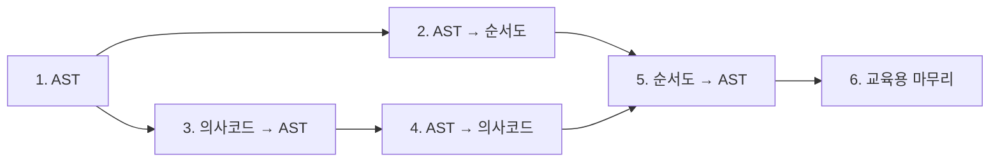

# 구현 단계 기록

이 폴더는 프로젝트를 1단계부터 6단계까지 구현한 내용을 단계별로 기록합니다. 모든 단계는 완료 상태이며, 각 문서는 해당 단계에서 달성한 목표와 주요 산출물을 설명합니다.

현재 동작의 기준은 상위 `docs/`의 주제별 문서입니다. milestone 문서는 구현 순서와 결정 배경을 이해하기 위한 기록이므로, 이후 단계에서 교체된 임시 UI나 보완된 구현도 당시 맥락과 함께 적습니다.

## 단계 목록

| 단계 | 상태 | 핵심 결과 |
| --- | --- | --- |
| [1단계 — 프로젝트 설정과 AST](./01-project-setup-and-ast.md) | 완료 | React·TypeScript·Vite 설정, AST, 예제 데이터 |
| [2단계 — AST에서 순서도 생성](./02-ast-to-flowchart.md) | 완료 | 커스텀 기호, 그래프 변환, dagre 자동 배치 |
| [3단계 — 의사코드 파서](./03-pseudocode-parser.md) | 완료 | 들여쓰기 파서, 오류 위치, CodeMirror 입력 |
| [4단계 — 의사코드 생성기](./04-pseudocode-generator.md) | 완료 | AST→텍스트, 표준 출력, 왕복 테스트 |
| [5단계 — 순서도 직접 편집](./05-flowchart-editing.md) | 완료 | 마우스·터치 편집, 그래프→AST, 구조 검증 |
| [6단계 — 교육용 마무리](./06-education-polish.md) | 완료 | UI 정리, 예제·도움말, PNG 저장, 시각 회귀 수정 |

## 단계 간 의존 관계

양방향 변환의 전체 구조와 현재 유지보수 규칙은 다음 문서를 함께 참고합니다.

- [프로젝트 개요와 기술 결정](../project-overview.md)
- [아키텍처](../architecture.md)
- [의사코드와 AST](../pseudocode.md)
- [순서도 기호 규칙](../flowchart-symbols.md)
- [테스트와 유지보수](../testing.md)

